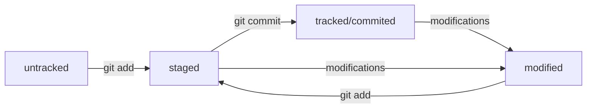

Список комманд для работы с Git
================================
Навигация  
---

**pwd** (от англ. print working directory, «показать рабочую папку») — покажи, в какой я папке
<br>
**ls** (от англ. list directory contents, «отобразить содержимое директории») — покажи файлы и папки в текущей папке
<br>
**ls -a** — покажи также скрытые файлы и папки, названия которых начинаются с символа .
<br>
**cd first-project** (от англ. change directory, «сменить директорию») — перейди в папку first-project
<br>
**cd first-project/html** — перейди в папку html, которая находится в папке first-project
<br>
**cd ..** — перейди на уровень выше, в родительскую папку
<br>
**cd** ~ — перейди в домашнюю директорию
<br>
**cd /** — перейди в корневую директорию
<br>
<br>

Работа с файлами и папками  
---

Создание  
---  

**touch index.html** (англ. touch, «коснуться») — создай файл index.html в текущей папке;
<br>
**touch index.html style.css script.js** — если нужно создать сразу несколько файлов, можно напечатать их имена в одну строку через пробел;
<br>
**mkdir second-project** (от англ. make directory, «создать директорию») — создай папку с именем second-project в текущей папке.
<br>

Копирование и перемещение  
---

**cp file.txt ~/my-dir** (от англ. copy, «копировать») — скопируй файл в другое место;
<br>
**mv file.txt ~/my-dir** (от англ. move, «переместить») — перемести файл или папку в другое место.
<br>

Чтение  
---

**cat file.txt** (от англ. concatenate and print, «объединить и распечатать») — распечатай содержимое текстового файла file.txt.
<br>

Удаление   
---  

**rm about.html** (от англ. remove, «удалить») — удали файл about.html;
<br>
**rmdir images** (от англ. remove directory, «удалить директорию») — удали папку images;
<br>
**rm -r second-project** (от англ. remove, «удалить» + recursive, «рекурсивный») — удали папку second-project и всё, что она содержит.
<br>

Полезные возможности  
--- 

Команды необязательно печатать и выполнять по очереди. Можно указать их списком — разделить двумя амперсандами **(&&)**.
<br>
У консоли есть собственная память — буфер с несколькими последними командами. По ним можно перемещаться с помощью клавиш со стрелками вверх (↑) и вниз (↓).
<br>
Чтобы не вводить название файла или папки полностью, можно набрать первые символы имени и дважды нажать Tab. 
<br>
Если файл или папка есть в текущей директории, командная строка допишет путь сама.
<br>
Например, вы находитесь в папке dev. Начните вводить **cd first** и дважды нажмите Tab. 
<br>
Если папка first-project есть внутри dev, командная строка автоматически подставит её имя. 
<br>
Останется только нажать Enter.
<br>

Работа с Git и коммитами
============================================================

Сделать папку репозиторием — **git init**
---

Чтобы Git начал отслеживать изменения в проекте, папку с файлами этого проекта нужно сделать Git-репозиторием (от англ. repository — «хранилище»). Для этого следует переместиться в неё и ввести команду **git init** (от англ. initialize — «инициализировать»).

```
$ cd ~/dev/first-project # перешли в нужную папку

$ git init # создали репозиторий 
```

Вы можете создать папку в любом месте на компьютере. Но в этом случае не забывайте менять в наших примерах путь ~/dev/first-project на тот, который ведёт к вашей папке. Помните, что не рекомендуется создавать репозиторий Git внутри другого Git-репозитория. Это может вызывать проблемы с отслеживанием изменений.

В некоторых случаях при инициализации репозитория Git может показать объёмное сообщение, которое начинается со слов Using 'master' as the name…. Не пугайтесь: это не ошибка. Пока это сообщение не имеет большого значения.

Также **git init** выведет сообщение вида Initialized empty Git repository in <*ваша папка с проектом*>/.git/ (англ. «инициализирован пустой Git-репозиторий в <*ваша папка*>/.git/»). В подпапке .git Git будет хранить всю служебную информацию.

Команда **git init** — одна из редко применяемых, ведь репозиторий создаётся один раз, а пользоваться им можно сколько угодно долго.

Если вы случайно сделали Git-репозиторием не ту папку, её можно «разгитить». 

Для этого нужно удалить скрытую подпапку .git.
```
$ cd <папка с репозиторием> # перешли в папку

$ rm -rf .git # удалили подпапку .git 
```


Проверить состояние репозитория — **git status**  
---
   
**git status** (от англ. status — «статус», «состояние») — показывает текущее состояние репозитория.

Команда **git status** выведет:

* название текущей ветки: On branch master или On branch main;

* сообщение о том, что в репозитории ещё нет коммитов: No commits yet;

* сообщение, которое говорит: «чтобы что-нибудь закоммитить (то есть зафиксировать), нужно сначала это создать» — nothing to commit (create/copy files and use "git add" to track).

В отличие от git init, команду git status используют часто. В любой непонятной ситуации стоит посмотреть состояние (статус) репозитория, а потом решить, что делать дальше.

**git add** позволяет подготовить файл к сохранению.
**git add --all** подготовит к сохранению сразу все файлы.
**git add .** можно добавить в репозиторий текущую папку со всеми файлами.

Выполнить коммит — **git commit**

Сделать коммит можно командой git commit c ключом -m (от англ. message — «сообщение»), который присваивает коммиту сообщение.

```
$ git commit -m ‘Мой первый коммит!’
```

Сначала команда **git add** сообщает Git, какие именно файлы нужно сохранить и какую их версию. 

Затем с помощью команды **git commit** происходит само сохранение. 

**git log** - посмотреть историю коммитов


Обратите внимание, что по умолчанию **git log** выводит коммиты в обратном хронологическом порядке — последние коммиты оказываются первыми сверху. 

В этом можно убедиться, если посмотреть на дату и время их создания.

Если после выполнения команды вы видите, что в репозитории есть только один коммит или их нет вообще, вернитесь к прошлому уроку и убедитесь, что **git add** и **git commit** были вызваны в нужном порядке.

Получить сокращённый лог — **git log --oneline**

Получить сокращённый лог можно с помощью команды **git log** с флагом **--oneline** (англ. «одной строкой»). В терминале появятся только первые несколько символов хеша каждого коммита и их комментарии.

Сокращённый лог полезен, если в репозитории уже много коммитов — например, сотни или тысячи. В этом случае можно быстро найти нужный по описанию.
Сокращённый хеш (то есть первые несколько символов полного) можно использовать точно так же, как и полный. Для этого команда git log --oneline автоматически подбирает такую длину сокращённых хешей, чтобы они были уникальными в пределах репозитория и Git всегда мог понять, о каком коммите идёт речь.

Файл HEAD
-------------


Файл **HEAD** (англ. «голова», «головной») — один из служебных файлов папки .git. Он указывает на коммит, который сделан последним (то есть на самый новый).
В этом можно убедиться с помощью терминала. Перейдите в папку .git командой **cd**. Посмотрите содержимое файла **HEAD** командой **cat**.

```
$ cd .git/
$ ls # посмотрели, какие есть файлы
COMMIT_EDITMSG  ORIG_HEAD  description  index  logs/     refs/
HEAD            config     hooks/       info/  objects/

$ cat HEAD # команда cat показывает содержимое файла
ref: refs/heads/master # в файле вот такая ссылка 
```

Внутри **HEAD** — ссылка на служебный файл: refs/heads/master (или refs/heads/main в зависимости от названия ветки). Если заглянуть в этот файл, можно увидеть хеш последнего коммита.

```
$ cat refs/heads/master # взяли ссылку из файла HEAD
# внутри хеш
e007f5035f113f9abca78fe2149c593959da5eb7

$ git log 
# сверяем с хешем последнего коммита
commit e007f5035f113f9abca78fe2149c593959da5eb7
Author: John Doe <johndoe@example.com>
Date:   Tue Mar 28 00:26:53 2023 +0300

    Добавить амбиций в список дел

... # другие коммиты 
```

Когда вы делаете коммит, Git обновляет refs/heads/master — записывает в него хеш последнего коммита. Получается, что HEAD тоже обновляется, так как ссылается на refs/heads/master.

При работе с Git указатель **HEAD** используется довольно часто. Мы уже упоминали, что многие команды Git принимают в качестве параметра хеш коммита. 

Если нужно передать последний коммит, то вместо его хеша можно просто написать слово **HEAD** — Git поймёт, что вы имели в виду последний коммит.


Статусы untracked/tracked, staged и modified
======================================

Одна из ключевых задач Git — отслеживать изменения файлов в репозитории. Для этого каждый файл помечается каким-либо статусом. 

Основные:

* untracked (англ. «неотслеживаемый»)

  Новые файлы в Git-репозитории помечаются как untracked, то есть неотслеживаемые. Git «видит», что такой файл существует, но не следит за изменениями в нём.
  
  У untracked-файла нет предыдущих версий, зафиксированных в коммитах или через команду git add.

* staged (англ. «подготовленный»)

  После выполнения команды git add файл попадает в staging area (от англ. stage — «сцена», «этап [процесса]» и area — «область»), то есть в список файлов, которые войдут в коммит. 
  
  В этот момент файл находится в состоянии staged.
  
* tracked (англ. «отслеживаемый»)

Состояние tracked — это противоположность untracked. Оно довольно широкое по смыслу: в него попадают файлы, которые уже были зафиксированы с помощью git commit, а также файлы, которые были добавлены в staging area командой git add. То есть все файлы, в которых Git так или иначе отслеживает изменения.

* modified (англ. «изменённый»)

Состояние modified означает, что Git сравнил содержимое файла с последней сохранённой версией и нашёл отличия. Например, файл был закоммичен и после этого изменён.

Жизненный цикл файла в Git
-------------------------------



1. Файл только что создали. Git про него ещё ничего не знает. Состояние: untracked.
2. Файл добавили в staging area с помощью git add. Состояние: staged (+ tracked).
   * Возможно, изменили файл ещё раз. Состояния: staged, modified (+ tracked).
   
     Обратите внимание: staged и modified у одного файла, но у разных его версий.
	 
   * Ещё раз выполнили git add. Состояние: staged (+ tracked).
   
3. Сделали коммит с помощью git commit. Состояние: tracked.
4. Изменили файл. Состояние: modified (+ tracked).
5. Снова добавили в staging area с помощью git add. Состояния: staged (+ tracked).
6. Сделали коммит. Состояния: tracked.
7. Повторили пункты 4−7 много-много раз.
  
Большинство файлов в проектах «шагает» по следующему циклу: 

«изменён» → «добавлен в список на коммит» → «закоммичен» → «изменён» → и так далее.

Работа с GitHub
=========================================================

* GitHub — платформа, которая работает с Git и упрощает командное взаимодействие.
* Кроме GitHub, существуют и другие подобные платформы, например GitLab, Bitbucket и так далее.
* Git — это консольный инструмент для работы с локальными и удалёнными репозиториями. Он не связан напрямую ни с одной из платформ и развивается отдельно от них.

Привязать удалённый репозиторий к локальному — **git remote add**

```
$ cd ~/dev/first-project
$ git remote add origin git@github.com:%ИМЯ_АККАУНТА%/first-project.git 
```

**origin** (англ. «источник») — стандартный псевдоним, с помощью которого можно обращаться к главному удалённому репозиторию (обычно такой репозиторий один). Это значительно упрощает работу.

Убедиться, что репозитории связаны, — **git remote -v**

```
$ git remote -v
origin    git@github.com:%ИМЯ_АККАУНТА%/%ИМЯ-ПРОЕКТА%.git (fetch)
origin    git@github.com:%ИМЯ_АККАУНТА%/%ИМЯ-ПРОЕКТА%.git (push) 
```

Флаг -v — короткая форма флага --verbose (англ. «подробный»). Он позволяет показать больше информации в выводе.

Отправить изменения на удалённый репозиторий — **git push**

В первый раз эту команду нужно вызвать с флагом -u и параметрами origin (имя удалённого репозитория) и main или master (название текущей ветки). Флаг -u свяжет локальную ветку с одноимённой удалённой. Как вы связывали локальный и удалённый репозитории в предыдущем уроке, так же и здесь нужно дополнительно связать ветки.

```
$ git push -u origin main # Если команда приведёт к ошибке, попробуйте 
                          # заменить main на master. 
```

Если вы указывали кодовую фразу при настройке SSH-ключей, её нужно будет ввести.

В дальнейшем при работе с удалённым репозиторием флаг -u можно опустить и писать просто **git push**.

* Коммиты хранятся в ветках. Начальная ветка создаётся автоматически и называется **main** или **master**.
* За отправку изменений на удалённый репозиторий отвечает команда **git push**.
* Интерфейс GitHub позволяет удобно просмотреть все коммиты в репозитории, а также изменения в этих коммитах.

SSH ключ
==================================

SSH (от англ. Secure Shell Protocol) обеспечивает безопасный обмен данными в сети. С помощью этого протокола можно получать данные с удалённого компьютера или отправлять их на него. Трафик шифруется, поэтому протокол безопасен.

SSH использует пару ключей для обеспечения безопасности — публичный и приватный: 

* Приватный ключ (англ. private key) хранится только на вашем компьютере и не должен передаваться кому-либо ещё. Он используется для расшифровки данных.
* Публичный ключ (англ. public key) доступен всем и используется для шифрования данных. Они могут быть расшифрованы парным приватным ключом.

Проверка наличия SSH-ключа

Прежде чем генерировать SSH-ключи, убедитесь, что у вас их ещё нет. По умолчанию директория с SSH-ключами находится в домашней директории пользователя. Перейдите в неё.

```
$ cd ~ # перешли в домашнюю директорию 
```

Обычно SSH-ключи находятся в директории .ssh/. Проверить наличие этой директории и файлов в ней можно с помощью следующей команды.

```
$ ls -la .ssh/ # вывели список созданных ключей
``` 

Если папка пустая или её нет, всё в порядке. 

Инструкция по генерации SSH-ключа
---


Для генерации SSH-пары можно использовать программу ssh-keygen. Откройте терминал и введите следующую команду.

```
$ ssh-keygen -t ed25519 -C "электронная почта, к которой привязан ваш аккаунт на GitHub" 

```

Используйте электронную почту, к которой привязан ваш GitHub-аккаунт.
    
Если вы видите сообщение об ошибке, то, скорее всего, ваша система не поддерживает алгоритм шифрования ed25519. Ничего страшного: используйте другой алгоритм.

```
$ ssh-keygen -t rsa -b 4096 -C "электронная почта, к которой привязан ваш аккаунт на GitHub" 
```

После ввода отобразится такое сообщение.

```
> Generating public/private rsa key pair. # сгенерированы публичный и приватный ключи 
```

Укажите место хранения ключей. Простой вариант — сделать домашний каталог пользователя путём по умолчанию. Для этого нажмите Enter.

**macOS**

```
> Enter a file in which to save the key (/Users/you/.ssh/id_rsa): [Press enter] 
```

**Windows**

```
> Enter a file in which to save the key (C:\Users\<имя_пользователя>\.ssh\):[Press enter] 
```

Теперь в указанной директории появится пара ключей.
Программа запросит кодовую фразу (англ. passphrase) для доступа к SSH-ключу. Вы можете оставить поле пустым. Для этого нажмите Enter, а затем ещё раз Enter для подтверждения.

```
> Enter passphrase (empty for no passphrase): [Type a passphrase]
> Enter same passphrase again: [Type passphrase again] 
```

Теперь осталось проверить, что ключи действительно сгенерировались. Для этого вызовите эту команду.

```
ls -a ~/.ssh 
```

На экране должны появиться два файла — один с расширением .pub, другой — без. Файл в .pub — публичный, им можно делиться с веб-сайтами или коллегами. Файл без расширения .pub — приватный. Ни в коем случае не передавайте его никому! 
